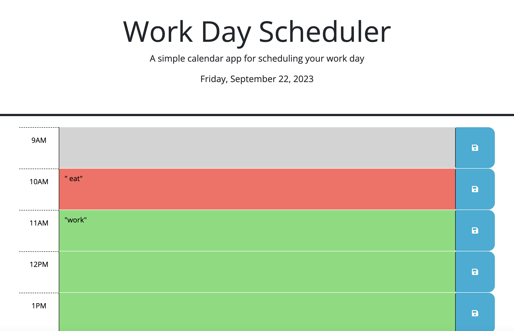
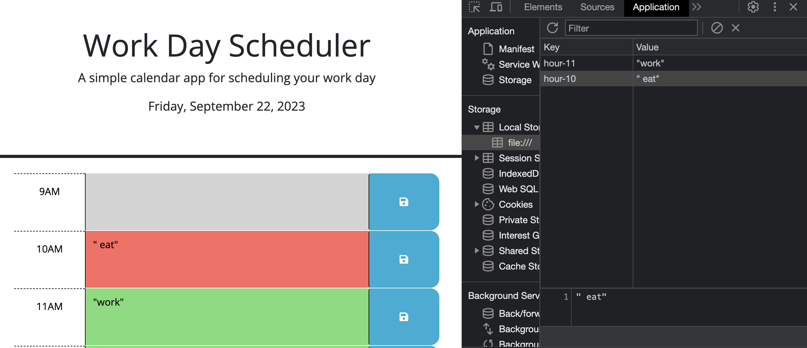

# Workday Scheduler

## Description

This project is a workday scheduler that allows users to save events for each hour of a working day. The scheduler will grab any saved schedule items from local storage and populate them into the corresponding timeslot. This scheduler also gets the time from your computer, and adds a class to the time block depending on what time of day it currently is.

## Installation

Click the link below to go to the project's github repo and clone the code to your machine: 
https://github.com/whitbreezy/workday-scheduler

Click the link below to access the live application:
https://whitbreezy.github.io/workday-scheduler/

## Usage

Below is a screenshot of the working application:

Here is a screenshot of the schedule items in local storage: 

## Credits

I used starter code provided by my bootcamp instructors on this project. View and clone the starter code here:
https://github.com/coding-boot-camp/crispy-octo-meme

## License

See repo for license info.
